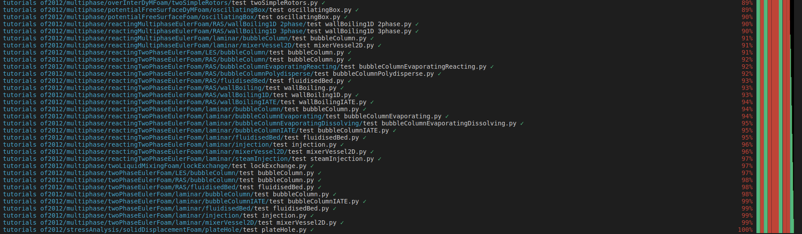
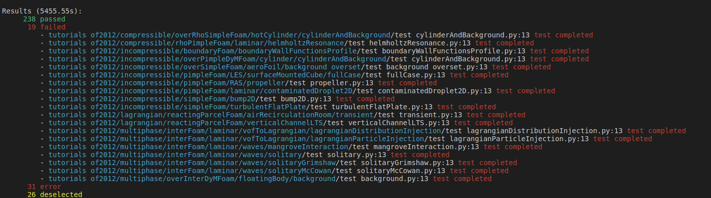

=====
Usage
=====

add conftest.py and pytest.ini to your project

cat pytest.ini:

::

	[pytest]
	#minversion = 6.0
	addopts = -ra -v --import-mode=importlib --tb=no --cache-clear
	testpaths =
		tests

cat conftest.py:

::

	import pytest

	def pytest_addoption(parser):
		parser.addoption(
			"--writeNSteps", action="store", default=0, help="only perform specified number of timestep"
		)
		parser.addoption(
			"--no-Allclean", action='store_false',default=True ,help="do not clean case after run"
		)

we assume that all OpenFOAM tests are located in the tests folder and that each test can be started with a
Allrun or Allclean script. By adding a test_*.py to each OpenFOAM test, pytest automatically discovers all
tests in the folder and they can be run with:

::

	py.test

with the command line option the test only run one time step

::

	py.test --writeNSteps 1

Running all OpenFOAM
--------------------

cp -r $FOAM_TUTORIALS OfTestTut
cd OfTestTut

add file add_tests.py with:

::

	import os
	import glob
	from shutil import copyfile

	def list_files(filepath):
		paths = []
		for root, dirs, files in os.walk(filepath):
		for file in files:
			if file == "Allrun":  #lower().endswith(filetype.lower()):
				paths.append(os.path.join(root, file))
		return paths

	allruns = list_files(".")

	VALID_DIRS = ["compressible","combustion","discreteMethods","DNS",
				"electromagnetics","finiteArea","heatTransfer","incompressible",
				"lagrangian","multiphase","stressAnalysis",]

	test_template = "test_template.py"

	for allrun in allruns:

		for v_dir in VALID_DIRS:
			if v_dir in allrun:
				dir_name = os.path.dirname(allrun)
				basename = os.path.basename(dir_name)
				test_filename = "test_" + basename + ".py"
				dst = os.path.join(dir_name,test_filename)
				copyfile(test_template, dst)

add test_template.py with:

::

	import os
	import pytest
	import oftest
	from oftest import run_case

	def test_completed(run_case):
		log = oftest.path_log()
		assert oftest.case_status(log) == 'completed' # checks if run completes

python add_test.py # adds the test_files

Running

::

	py.test --co

should yield rougly 300 collects tests

The test are then run with

py.test --writeNSteps=1 -k "not adjoint"

with both these options we run the test one timestep without any test containing the adjoint keyword (they take along time)

and we should get following output

and finally a report

Parameters
----------

the parameters of a test case can be varied by decorating the function with:

::

	class TestClass2:

		file_modification =  { "system/fvSolution": [ ("PIMPLE/momentumPredictor",1),
													("PIMPLE/nCorrectors",2) ] }

		dir_name = os.path.dirname(os.path.abspath(__file__)) # path the test file

		mod_fvSolution = oftest.Case_modifiers(file_mod1,dir_name)

		@pytest.mark.parametrize("run_case",[mod_fvSolution], indirect=True)
		def test_parameter(self,run_case,load_parser_transport):
			log = oftest.path_log()
			assert oftest.case_status(log) == 'completed' # checks if run completes

now the parameters in the test_parameter are changed

Extensions
----------

Running py.test with multple threads:

pip install pytest-xdist

the output can be pretified with the extension:

pip install pytest-sugar